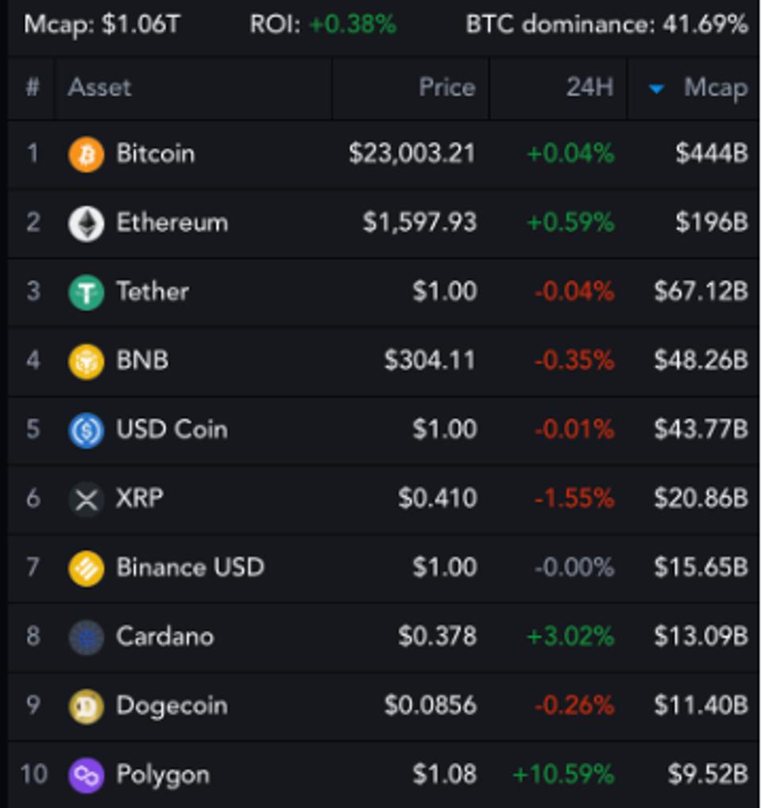

# Análisis de criptomonedas
Utilice el  Python y Power Bi para analizar y pronosticar criptomonedas populares y para analizar tendencias dentro del mercado de finanzas descentralizadas (DeFi).

## Panel de control del proyecto
Link de dashboard [aqui]

## DESCRIPCIÓN

La criptomoneda, una forma de dinero digital descentralizado basado en la tecnología blockchain, ha ganado mucha popularidad en los últimos años. Como la criptografía es una inversión altamente especulativa con el potencial de intensas fluctuaciones de precios, los expertos tienen opiniones encontradas sobre la inversión en criptomonedas.

A partir del mes de marzo de 2023, el valor de mercado combinado de los bitcoins del mundo ascendía a más de 1,06 billones y el precio de mercado global de un solo bitcoin era de 23,003.21 dólares. (Ref: Investopedia) y el mercado mas alla de la volatilidad sigue creciendo.

Las siguientes son las 10 principales criptomonedas (Ref: Forbes - marzo 2023):

