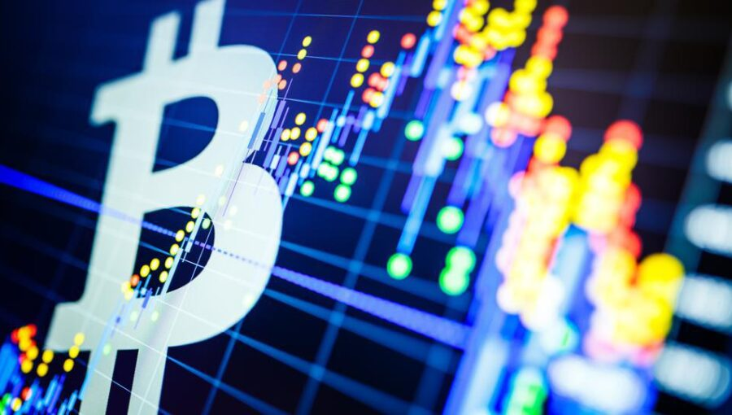
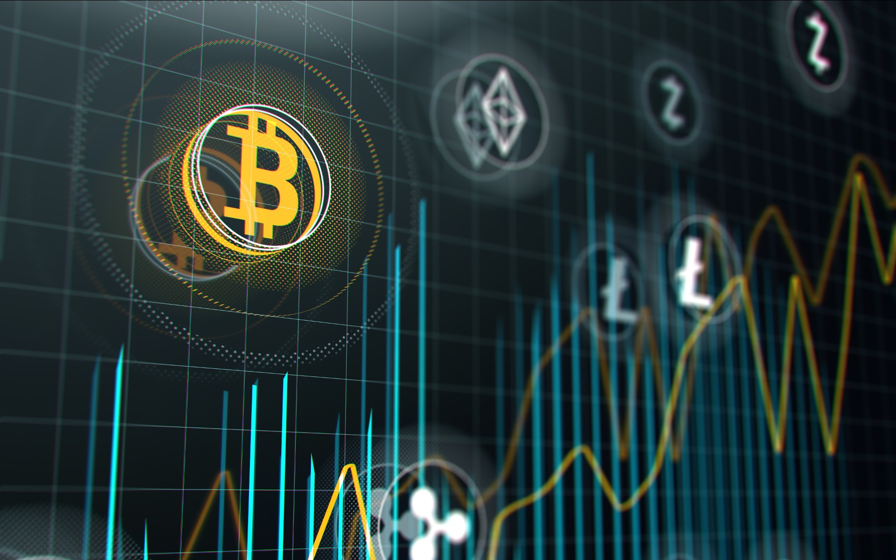

# 🚀 Análisis de Datos de Criptomonedas 📊
En este proyecto, utilizamos Python y Streamlit para llevar a cabo un análisis detallado y realizar calculos de ganancias o perdidas potenciales en relación a las criptomonedas que seleccionaremos para este proyecto. ¡Vamos a explorar juntos las tendencias que prevalecen dentro del emocionante mundo de las finanzas descentralizadas (DeFi)! 
 

## ## 📊 Panel de Control del Proyecto
¿Listo para explorar el panel de control y los análisis completos? [¡Haz clic aquí para acceder!](http://localhost:8501)

 
 

## 📚 Descripción

El año 2020 marcó un hito en la adopción institucional de Bitcoin. Grandes empresas, fondos de inversión y gestores de activos comenzaron a considerar Bitcoin, junto con otras criptomonedas, como una forma legítima de inversión y almacenamiento de valor. ¡La revolución había comenzado! 💰

Este aumento de interés no solo provino de inversores institucionales, sino también del público en general. Las plataformas de inversión y aplicaciones para adquirir criptomonedas se volvieron más accesibles que nunca, democratizando la inversión y el acceso al mercado. 🌍

Un ejemplo destacado es Bitcoin: su oferta limitada, combinada con los eventos de halving, influyó en el incremento de su precio. Aproximadamente cada 4 años, ocurre un halving que reduce a la mitad la recompensa de los mineros por validar transacciones. Esta escasez percibida ha contribuido al aumento de la demanda. ⛏️

Además, muchas compañías comenzaron a aceptar criptomonedas como forma de pago, reforzando su legitimidad y demanda. La aceptación de criptomonedas por parte de empresas reconocidas aumenta su utilidad y, por lo tanto, su valor percibido. 💡

Los estímulos económicos implementados en respuesta a la pandemia de COVID-19 y las políticas de flexibilización cuantitativa generaron preocupaciones sobre la inflación y devaluación de las monedas fiduciarias. Algunos inversores buscaron refugio en activos como Bitcoin, considerados una reserva de valor en tiempos de incertidumbre. 🌐

El aumento en el precio de Bitcoin, junto con Ethereum, las principales monedas con mayor capitalización de mercado, y otras criptomonedas, atrajo una cobertura mediática significativa. Esto impulsó la conciencia pública y el interés en el mercado de criptomonedas, contribuyendo al aumento de la demanda. Por ello, nuestro análisis se enfoca en el periodo de 2020 a 2023. 📈

## TOKENS SELECCIONADOS 

 
 

¡Aquí presentamos una descripción breve de las criptomonedas seleccionadas para este proyecto!

* **Binance Coin (BNB):** BNB es la moneda nativa de Binance, una de las principales plataformas de intercambio de criptomonedas. Muchos inversores podrían considerar invertir en BNB debido a su utilidad en la plataforma Binance, como descuentos en tarifas de intercambio y acceso a ventas de tokens. Además, el crecimiento de Binance como plataforma podría impactar positivamente en la demanda de BNB. 💱

* **Bitcoin (BTC):** itcoin es considerado como oro digital y una reserva de valor. Muchos inversores ven a Bitcoin como un activo seguro y una forma de diversificar sus carteras. La escasez de suministro, la adopción institucional y la cobertura mediática hacen que Bitcoin sea atractivo para aquellos que buscan inversiones a largo plaz. ₿

* **Cardano (ADA):** Cardano se centra en la investigación científica y el desarrollo de soluciones robustas. Su enfoque en la escalabilidad y la sostenibilidad podría atraer a inversores interesados en proyectos blockchain de alto potencial. Además, su plataforma para contratos inteligentes y aplicaciones descentralizadas también podría ser un factor atractivo. 🏛️

* **Dogecoin (DOGE):** Dogecoin comenzó como una broma, pero ha ganado una comunidad activa. Algunos inversores pueden considerar DOGE como una inversión especulativa o como una forma de apoyar causas benéficas y proyectos comunitarios. Sin embargo, debido a su naturaleza volátil y falta de casos de uso claros, también conlleva un alto riesgo. 🐶

* **Ethereum (ETH):** Ethereum es una plataforma líder para contratos inteligentes y dApps. Muchos inversores ven a Ethereum como el "Internet de las finanzas" y creen en su capacidad para transformar industrias. El crecimiento del ecosistema DeFi y NFT (tokens no fungibles) en la plataforma podría aumentar su demanda. 💡

* **Polkadot (DOT):** Polkadot busca habilitar la interoperabilidad entre diferentes blockchains. Aquellos que creen en la importancia de la interoperabilidad y la conexión entre diferentes proyectos blockchain podrían considerar invertir en DOT. 🔗

* **Ripple (XRP):** Ripple se centra en facilitar transferencias internacionales de dinero. Inversores interesados en soluciones de pagos globales podrían considerar XRP. Sin embargo, el litigio actual con la SEC ha afectado la percepción de riesgo asociada con esta moneda. 💸

* **Solana (SOL):** Solana se destaca por su alta velocidad y escalabilidad. Inversores interesados en aplicaciones descentralizadas y DeFi podrían considerar SOL debido a su capacidad para manejar un alto rendimiento. ☀️

* **Tether (USDT):** Tether es una criptomoneda estable vinculada al dólar estadounidense. Muchos inversores utilizan USDT como una forma de mantener estabilidad de valor en momentos de volatilidad, así como para facilitar el trading en exchanges. 💲

* **USD Coin (USDC):** Similar a Tether, USD Coin es una criptomoneda estable vinculada al dólar estadounidense. Aquellos que buscan una alternativa estable en el mundo de las criptomonedas podrían considerar USDC.💲

# EN CONCLUSION:

* *Varias de estas monedas, como Bitcoin y Ethereum, son ampliamente reconocidas y aceptadas en la comunidad financiera y más allá. Su adopción por parte de empresas y comerciantes brinda legitimidad a estas criptomonedas.

* *Proyectos como Ethereum y Cardano han impulsado la innovación tecnológica al permitir la creación de contratos inteligentes y aplicaciones descentralizadas. Estas características tienen el potencial de revolucionar la forma en que se realizan transacciones y se desarrollan aplicaciones en línea.

* Plataformas como Polkadot están enfocadas en mejorar la interoperabilidad entre diferentes blockchains. Esto podría permitir un flujo más fluido de información y activos entre diferentes proyectos y cadenas.
Uso Real: Ripple y sus soluciones para pagos internacionales, así como Tether y USD Coin como stablecoins vinculadas al valor del dólar, tienen aplicaciones prácticas en la vida real y en el mundo financiero.

* Proyectos como Dogecoin tienen comunidades entusiastas y leales que participan activamente en su desarrollo y promoción. Esto puede contribuir a la longevidad y el crecimiento sostenible de la moneda.

* En el pasado, algunas de estas monedas han experimentado aumentos significativos en su valor, lo que ha brindado oportunidades para obtener ganancias a los inversores.

* Muchos de estos proyectos están en constante desarrollo y mejora. Los equipos de desarrollo detrás de estas monedas trabajan en actualizaciones y mejoras que podrían aumentar su utilidad y valor a largo plazo.

*  Ethereum y otros proyectos permiten la creación y participación en finanzas descentralizadas (DeFi), que son aplicaciones financieras que funcionan en la cadena de bloques y pueden ofrecer oportunidades de inversión y rendimiento.

* Monedas como Bitcoin tienen un suministro limitado, lo que puede generar una escasez percibida y aumentar la demanda, potencialmente influyendo en su valor.

* En momentos de incertidumbre económica, algunas personas buscan refugio en activos como Bitcoin, considerándolo como una reserva de valor en tiempos de volatilidad.

### ¡Explora más a fondo cada criptomoneda y considera cómo se alinean con tus objetivos y estrategia de inversión!

#### ⚠️ Importante: Es crucial tener en mente que la inversión en criptomonedas implica riesgos significativos y que la situación del mercado puede cambiar con gran rapidez. Antes de considerar cualquier inversión, es altamente recomendable llevar a cabo una investigación exhaustiva sobre cada proyecto. Además, es esencial evaluar tu tolerancia al riesgo y definir claramente tus objetivos financieros. Las criptomonedas son activos volátiles y no adecuados para todos los perfiles de inversores. ¡Siempre mantén la cautela y la prudencia en mente! 🚀📊🛡️

